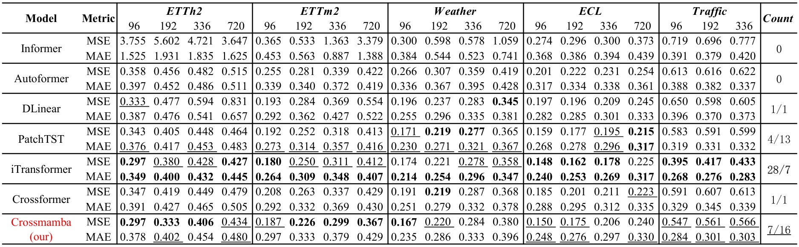

# Crossmamba ([Data Mining and Knowledge Discovery](https://link.springer.com/journal/10618))

## This is an offical implementation of Crossmamba: [Multivariate Time Series Forecasting Model for Cross-temporal and Cross-dimensional Dependencies with Mamba](). 

## Key Points

<div>
    <p align="center">
    	
    </p>
    <p align="center">
    	<strong>Figure 1:</strong>
        Crossmamba’s SNED structure.
    </p>
    <p>
         The length of each vector represents the time range of the sequence it covers. The core of the structure is the FDSE layer, which learns the cross-temporal and cross-dimensional dependencies of MTS through two MamMLP blocks. The encoder (left) uses FDSE layers and spectral noise to capture dependencies at different coarse scales: the three FDSE layers located above were noisy with different frequency components to obtain information on different coarse scales. The decoder (right) deciphers the information at different scales, predicts the sequence at the corresponding scale, and adds them together to make the final prediction.
    </p>
</div>
<div style="margin-top: 50px">
    <p align="center">
    	
    </p>
    <p align="center">
    	<strong>Figure 2:</strong>
        The structure and introduction of all Crossmamba's modules.
    </p>
</div>


## Requirements

```
pip install torch causal-conv1d mamba-ssm numpy pandas einops tqdm
```

## Running

- You can download all datasets from https://github.com/thuml/Autoformer and put them in the `datasets/` directory.

- To get results of Crossmamba with $T=96,\tau=96$ on ETTh1 dataset, run:

  ```bash
  python main_crossmamba.py --data ETTh1 --in_len 96 --out_len 96 --t_cycle 6 --d_model 32 --d_ff 32 --d_state 1
  ```

This is just an example, where t_cycle, d_model, d_ff, and d_state are adjustable hyper-parameters.

The model will be automatically trained and tested. The trained model will be saved in folder `checkpoints/` and evaluated metrics will be saved in folder `results/`.

- You can also evaluate a trained model by running:

  ```bash
  python eval_crossmamba.py --checkpoint_root ./checkpoints --setting_name Crossmamba_ETTh196__in96_seg6__dmodel-32_dstate-1_dff-32_dropout0.2_batch32___lrtype1_itr0
  ```

## Reproduction
We provide the original model parameters of the `ETTm2` dataset. After you download the dataset, you can run the following command to reproduce. These experiments are based on a train/val/test split ratio of 0.6:0.2:0.2.

```bash
python eval_crossmamba.py --checkpoint_root ./checkpoints --setting_name Crossmamba-ETTm2-96-96-code
python eval_crossmamba.py --checkpoint_root ./checkpoints --setting_name Crossmamba-ETTm2-96-192-code 
python eval_crossmamba.py --checkpoint_root ./checkpoints --setting_name Crossmamba-ETTm2-96-336-code 
python eval_crossmamba.py --checkpoint_root ./checkpoints --setting_name Crossmamba-ETTm2-96-720-code
```

## Results

- The results of multivariate time series forecasting with history step size $T=96$. 

- The split ratio of ETTh2 and ETTm2 datasets is 0.6:0.2:0.2, and the split ratio of other datasets is 0.7:0.1:0.2.

- Red is our model.

- The official implementation results for more data sets will be supplemented and improved later. The results currently provided are all presented in the paper.

  > [!NOTE]
  >
  > If there is a difference between the results in this GitHub repository and the paper, please refer to this repository - this is the official latest implementation version.


<p align="center">

</p>

## Acknowledgement

We appreciate the following github repo very much for the valuable code base and datasets:

https://github.com/zhouhaoyi/Informer2020

https://github.com/thuml/Autoformer

https://github.com/Thinklab-SJTU/Crossformer

https://github.com/yuqinie98/PatchTST

## Contact

If you have any questions or concerns, please contact us: YuhanLin4038@outlook.com or 2679146671@qq.com or submit an issue

## Citation

If you find this repo useful in your research, please consider citing our paper as follows:

```
@article{YL-2025-Crossmamba,
  title={Crossmamba: Multivariate Time Series Forecasting Model for Cross-temporal and Cross-dimensional Dependencies with Mamba},
  author={Yuhan Lin, Liping Xiong, Zhiyong Hong, Zhiqiang Zeng, Jian Zeng, Guoqiang Zeng},
  journal={Data Mining and Knowledge Discovery},
  year={2025}
}
```

